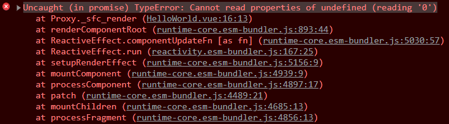

# Vue Tips

## Vscode tooling&#x20;

* use <mark style="color:orange;">volar</mark> for highlight and linting your code. Use it do not come back to vetur!!!

### Composition API to do the parent-child v-model (setup script)

Our purpose is to make a bi-directional data from parent to child.

```typescript
// Parent.vue
<InputDropdown v-model:infoData="inputData" />
```

```typescript
// Child.vue
<script setup>
import { reactive, ref } from "vue";

const props = defineProps({
	infoData: String,
});
const emit = defineEmits(["update:infoData"]);

const setDropdownSelected = (item) => {
	if (item !== "backspace") {
		dropdown.selectedItem += item;
		emit("update:infoData", dropdown.selectedItem);
	} else {
		dropdown.selectedItem = dropdown.selectedItem.slice(0, -1);
		emit("update:infoData", dropdown.selectedItem);
	}
};
</script>
```

### Pass data through router-link

```javascript
// routes.js
export const routes = [
	{ path: "/", component: Home, meta: { title: "Home" } },
	{
		path: "/businfo",
		meta: { title: "公車動態" },
		component: BusInfo,
		name: "BusInfo",
		props: true,
	},
	{ path: "/:path(.*)", component: NotFound },
];
```

```javascript
// Home.vue
<router-link :to="{ name: 'BusInfo', params: { inputData } }">go</router-link>
```

```javascript
// Destination.vue
<script setup>
const props = defineProps({
	inputData: String,
});
</script>
```

## Async Data Rendering problem

You may want fetch data with async calls. However, before you actually get the data, your template may not get the variable property. Because there is just no data. What you can is the put a `v-if`, Then everything will be fine.

```typescript
// Some codeyy
<script setup lang="ts">
import { useAxios } from "@vueuse/integrations/useAxios";
import Product from "@models/Product";

const { data: products } = useAxios<Product[]>("test/data");
</script>

<template>
    <div v-if="products">{{ products[0].name }}</div>
    <div v-for="product in products" :key="product.prodId">
        {{ product.name }}
    </div>
</template>
```


